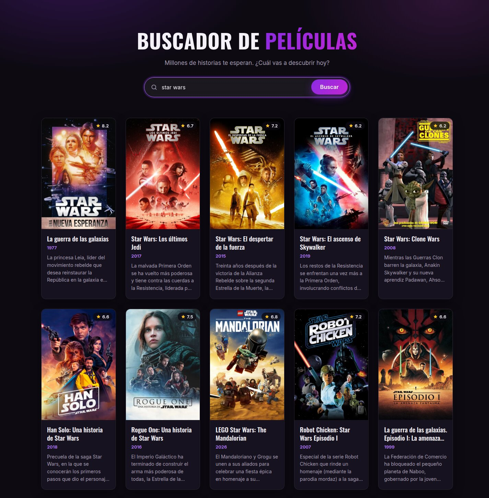
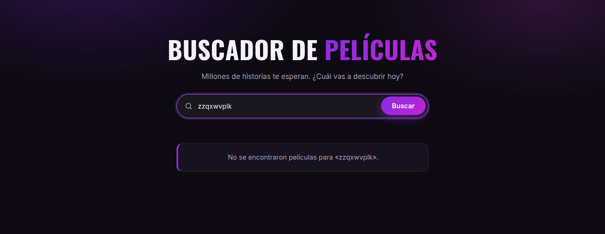
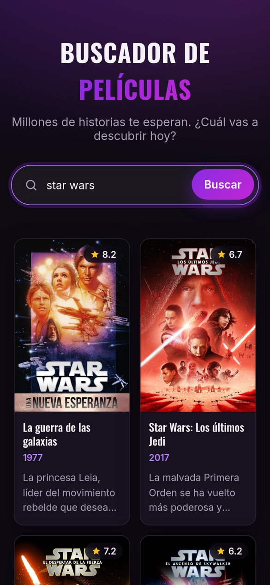

<div align="center">

# Buscador de Películas

**Millones de historias te esperan. ¿Cuál vas a descubrir hoy?**

Aplicación web para buscar películas en tiempo real con datos de [TheMovieDB](https://www.themoviedb.org/).

[](https://react.dev/)
[](https://vite.dev/)
[](https://developer.themoviedb.org/)
[](https://movie-app-natan.netlify.app/)
[](LICENSE)

[**Ver demo en vivo**](https://movie-app-natan.netlify.app/)



</div>

## Tabla de contenidos

- [Funcionalidades](#funcionalidades)
- [Capturas](#capturas)
- [Tecnologías](#tecnologías)
- [Primeros pasos](#primeros-pasos)
- [Variables de entorno](#variables-de-entorno)
- [Scripts disponibles](#scripts-disponibles)
- [Estructura del proyecto](#estructura-del-proyecto)
- [Despliegue](#despliegue)
- [Créditos](#créditos)
- [Licencia](#licencia)
- [Autor](#autor)

## Funcionalidades

- **Búsqueda de películas** por título usando la API de TheMovieDB, con resultados en español.
- **Cards con póster, puntuación, año y sinopsis**, en una grilla responsive de altura uniforme.
- **Placeholders** cuando una película no tiene póster («Sin imagen disponible») o sinopsis («Sin sinopsis disponible»).
- **Aviso de «sin resultados»** cuando la búsqueda no encuentra coincidencias.
- **Validación del formulario**: no se envían búsquedas vacías.
- **Aviso de configuración** en pantalla si falta la API key, en lugar de fallar en silencio.
- **Diseño oscuro moderno**, adaptado a móviles y respetuoso de `prefers-reduced-motion`.

## Capturas

| Sin resultados | Móvil |
| :---: | :---: |
|  |  |

## Tecnologías

| Categoría | Herramienta |
| --- | --- |
| UI | [React 19](https://react.dev/) (hooks) |
| Bundler y servidor de desarrollo | [Vite 7](https://vite.dev/) + [`@vitejs/plugin-react-swc`](https://github.com/vitejs/vite-plugin-react) |
| Estilos | CSS puro (variables, Grid, Flexbox) |
| Datos | [TMDB API v3](https://developer.themoviedb.org/docs) |
| Calidad de código | [ESLint 9](https://eslint.org/) |
| Hosting | [Netlify](https://www.netlify.com/) |

## Primeros pasos

### Requisitos previos

- [Node.js](https://nodejs.org/) 20.19+ o 22.12+ (requerido por Vite 7)
- Una cuenta gratuita en [TheMovieDB](https://www.themoviedb.org/signup) para obtener una API key

### Instalación

```bash
# 1. Clonar el repositorio
git clone https://github.com/natadominguez/AppDePeliculas.git
cd AppDePeliculas

# 2. Instalar dependencias
npm install

# 3. Crear el archivo de variables de entorno
cp .env.example .env
# Editá .env y completá VITE_TMDB_API_KEY con tu clave

# 4. Levantar el servidor de desarrollo
npm run dev
```

La aplicación queda disponible en `http://localhost:5173`.

## Variables de entorno

| Variable | Requerida | Descripción |
| --- | :---: | --- |
| `VITE_TMDB_API_KEY` | Sí | API Key (v3 auth) de TheMovieDB. Se obtiene en [themoviedb.org/settings/api](https://www.themoviedb.org/settings/api). |

> [!NOTE]
> Usá la **API Key (v3)**, de 32 caracteres, y no el *API Read Access Token* (v4).

> [!IMPORTANT]
> `.env` está en `.gitignore`, así que tu clave nunca se sube al repositorio. Como esta es una app que corre solo en el navegador, Vite incluye la clave en el bundle generado y es visible para cualquiera que inspeccione el sitio. Para ocultarla del todo haría falta un proxy en el backend o una función serverless.

## Scripts disponibles

| Comando | Descripción |
| --- | --- |
| `npm run dev` | Inicia el servidor de desarrollo con recarga en caliente. |
| `npm run build` | Genera la versión de producción en `dist/`. |
| `npm run preview` | Sirve localmente el build de producción. |
| `npm run lint` | Analiza el código con ESLint. |

## Estructura del proyecto

```text
AppDePeliculas/
├── docs/                 # Capturas usadas en este README
├── src/
│   ├── main.jsx          # Punto de entrada: monta <MovieApp /> en el DOM
│   ├── services/
│   │   └── movieService.js  # Acceso a la API de TMDB: searchMovies, getPosterUrl
│   ├── MovieApp.jsx      # Componente principal: estado de la búsqueda y render de resultados
│   ├── MovieApp.css      # Estilos del layout, el buscador y las cards
│   └── index.css         # Variables de tema y estilos globales
├── LICENSE               # Licencia MIT
├── .env.example          # Plantilla de variables de entorno
├── index.html            # HTML base y carga de fuentes (Inter y Oswald)
├── eslint.config.js
├── vite.config.js
└── package.json
```

## Despliegue

El proyecto está desplegado en **Netlify**. Para publicar tu propia copia:

1. Importá el repositorio en Netlify.
2. Configurá el build:
   - **Build command:** `npm run build`
   - **Publish directory:** `dist`
3. En *Site configuration → Environment variables*, agregá `VITE_TMDB_API_KEY`.
4. Desplegá el sitio. Si cambiás la variable más adelante, volvé a desplegar: Vite la inserta en tiempo de build.

## Créditos

- Proyecto desarrollado en el curso de **React.js** dictado por [Sergie Code](https://www.youtube.com/@SergieCode) en Digital House.
- Datos e imágenes provistos por [TheMovieDB](https://www.themoviedb.org/).

*Este producto usa la API de TMDB, pero no está respaldado ni certificado por TMDB.*

## Licencia

Distribuido bajo la licencia MIT. Ver [`LICENSE`](LICENSE) para más información.

## Autor

**Natanael Dominguez**: [GitHub @natadominguez](https://github.com/natadominguez)
